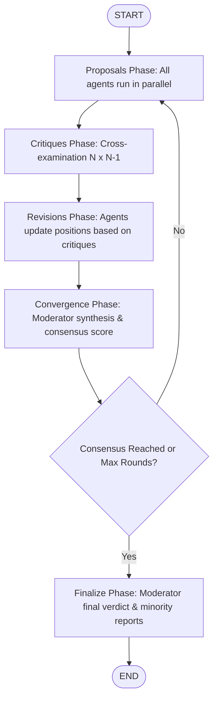
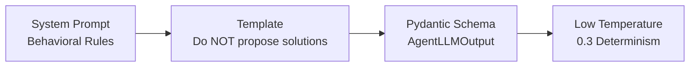

In **AgentBoard**, agents participate in a structured multi-agent debate orchestrated as a directed state machine using **LangGraph**. Every agent inherits from the abstract base class [BaseAgent](file:///d:/Learnings/My_Projects/Learning_Projects/AgentBoard-Multi_Agent_Decision_Engine/backend/app/agents/base_agent.py#L71-L370), operating within an asynchronous, multi-phase decision engine.

Below is an overview of the global agent workflow, followed by a **deep-dive detailed design of the [RiskAgent](file:///d:/Learnings/My_Projects/Learning_Projects/AgentBoard-Multi_Agent_Decision_Engine/backend/app/agents/risk_agent.py#L71-L149)**.

---

## 1. High-Level Multi-Agent Debate Workflow

Each round in the debate proceeds through four deterministic phases managed by [DebateGraph](file:///d:/Learnings/My_Projects/Learning_Projects/AgentBoard-Multi_Agent_Decision_Engine/backend/app/orchestrator/debate_graph.py#L69-L120) and [nodes.py](file:///d:/Learnings/My_Projects/Learning_Projects/AgentBoard-Multi_Agent_Decision_Engine/backend/app/orchestrator/nodes.py):



### The 4 Core Phases for Each Agent

1. **Proposal Phase (`proposals_node` -> `agent.run(state)`):**
   Agents independently analyze the user's query and formulate an initial perspective without seeing each other's work (with optional knowledge-base RAG and tool augmentation).
2. **Critique Phase (`critiques_node` -> `agent.critique(state, target)`):**
   Every agent cross-examines every other agent's proposal in parallel ($N \times (N-1)$ cross-evaluations).
3. **Revision Phase (`revisions_node` -> `agent.revise(state, critiques)`):**
   Agents receive all critiques targeted at them and revise their stance, either defending points with stronger justification, adapting, or conceding.
4. **Convergence Phase (`convergence_node`):**
   The [ModeratorAgent](file:///d:/Learnings/My_Projects/Learning_Projects/AgentBoard-Multi_Agent_Decision_Engine/backend/app/agents/moderator_agent.py) writes an advisory summary of the round. The node itself computes the agreement score (confidence blended with position overlap, or semantic similarity when enabled) and runs the six-signal consensus gate, which decides whether to stop. The Moderator's own continue/stop opinion is only logged.

---

## 2. Detailed Design: The Risk Agent ([RiskAgent](file:///d:/Learnings/My_Projects/Learning_Projects/AgentBoard-Multi_Agent_Decision_Engine/backend/app/agents/risk_agent.py))

The **Risk Agent** functions as the **adversarial stress-tester** of the debate board. Its explicit mandate is to discover failure modes, surface hidden assumptions, and identify tail risks.

### 2.1 Persona & Behavioral Contract

Defined in [risk_agent.py:L17-L33](file:///d:/Learnings/My_Projects/Learning_Projects/AgentBoard-Multi_Agent_Decision_Engine/backend/app/agents/risk_agent.py#L17-L33):

* **Primary Objective**: Identify risks, uncertainties, vulnerabilities, and worst-case scenarios.
* **Hard Invariant**: **Never propose solutions.** Proposing solutions creates confirmation bias and weakens the stress-testing role.
* **Risk Categorization**: Classify risks into 5 formal categories:
  * `Operational`
  * `Financial`
  * `Reputational`
  * `Technical`
  * `Regulatory`
* **Severity Scoring**: Rate each risk as `low`, `medium`, `high`, or `critical`.
* **Confidence Rating**: Assign a self-assessed calibration score between `0.0` and `1.0`.

---

---


In multi-agent systems, the biggest challenge with LLMs is that **by default, models try to be "helpful generalists"**: they agree with the user, try to fix everything at once, soften bad news, and jump to solutions prematurely.

The **Persona & Behavioral Contract** is the set of strict constraints that strips away the generalist mindset and turns the LLM into a **specialized, disciplined adversary**.

Here is a beginner-friendly breakdown of why each rule exists, how it controls the agent, and concrete examples.

---

### The Scenario We Will Use

> **Scenario:** A FinTech startup asks:
> *"Should we replace our 10 human fraud analysts with an automated AI fraud-detection model next month to cut costs by 70%?"*

---

### 1. Primary Objective: Identify Failure Modes, Not Answers

* **The Problem:** General LLMs naturally want to validate ideas: *"Yes, AI can detect fraud fast! Here is how to do it..."*
* **The Contract:** Forces the agent to act like a cynical senior risk auditor whose only job is to ask: **"Where will this blow up?"**

| Without Contract (Standard LLM)                                                                                    | With Persona Contract (Risk Agent)                                                                                                                                      |
| :----------------------------------------------------------------------------------------------------------------- | :---------------------------------------------------------------------------------------------------------------------------------------------------------------------- |
| "Replacing fraud analysts with AI is a great cost-saving move. AI models can review transactions in milliseconds." | "A 1-month cutover creates an extreme single-point-of-failure: if the AI model encounters unseen fraud patterns, there are zero human analysts left to catch the leak." |

---

### 2. Hard Invariant: *NEVER Propose Solutions*

#### Why is this rule so critical?

In a multi-agent debate:

1. **Separation of Concerns:** Proposing the business plan is the job of the [StrategyAgent](file:///d:/Learnings/My_Projects/Learning_Projects/AgentBoard-Multi_Agent_Decision_Engine/backend/app/agents/strategy_agent.py).
2. **Confirmation Bias:** The moment an agent suggests a solution (*"You should use a shadow AI deployment alongside humans"*), it falls in love with its own idea. It stops looking for risks because it is now defending its solution!

#### ❌ BAD (Violates the Contract):

> *"The risk is high, **so you should instead keep 3 analysts and run the AI in parallel for 6 months to test accuracy**."*
> *(Why it's bad: The agent just did Strategy's job and stopped stress-testing).*

#### ✅ GOOD (Follows the Contract):

> *"The proposal assumes zero false-positive spikes during the cutover. If the model triggers a 5% false-positive rate on legitimate transactions, thousands of customer cards will be frozen with no human team to unlock them."*
> *(Why it's good: Pure failure analysis. It forces the Strategy agent to figure out the fix).*

---

### 3. Risk Categorization: The 5 Formal Buckets

If an agent just gives an unstructured wall of text, other agents (and human executives) cannot parse what department is affected. The contract demands **5 clear categories**:

```
                              ┌── Operational
                              ├── Financial
               5 BUCKETS ─────┼── Reputational
                              ├── Technical
                              └── Regulatory
```

Applying this to our FinTech scenario:

1. **`Technical`**:
   * *Example:* "Concept drift. Fraudsters mutate tactics every 48 hours; a static or slowly retrained model will experience rapid accuracy decay within weeks."
2. **`Operational`**:
   * *Example:* "Knowledge loss. Firing the human team eliminates 10 years of institutional intuition that has not yet been codified into training data."
3. **`Financial`**:
   * *Example:* "Liability liability shift. A 1% increase in undetected synthetic identity fraud can wipe out the entire 70% payroll savings in 60 days."
4. **`Regulatory`**:
   * *Example:* "FCRA / Fair Lending violations. If the model rejects loan or credit card transactions without explainable reason codes, the company faces financial regulatory fines."
5. **`Reputational`**:
   * *Example:* "Customer churn from false declines. Legitimate high-net-worth users getting card blocks without phone support."

---

### 4. Severity Scoring: `low`, `medium`, `high`, `critical`

The agent cannot say *"this is kind of risky"* or *"this is super dangerous"*. It must assign a standardized severity rating:

* **`low`**: Minor friction, easily absorbed (e.g., small training delay).
* **`medium`**: Measurable impact, but recoverable without existential threat.
* **`high`**: Significant revenue loss, major customer impact, or senior leadership escalation.
* **`critical`**: Existential threat, business shutdown, catastrophic data loss, or regulatory revocation of license.

> In our scenario:
>
> * *Regulatory violation (unexplainable model rejections)* $\rightarrow$ **`critical`**
> * *Temporary staff onboarding friction for new dashboards* $\rightarrow$ **`low`**

---

### 5. Confidence Rating: `0.0` to `1.0`

Every output includes a `confidence_score` between `0.0` (pure guess) and `1.0` (mathematical certainty).

#### Why is this needed?

In [backend/app/services/consensus.py](file:///d:/Learnings/My_Projects/Learning_Projects/AgentBoard-Multi_Agent_Decision_Engine/backend/app/services/consensus.py), confidence weights the overlap between agents' positions. Each pair of agents counts with the average of their two confidences:

$$
\text{overlap score} = \frac{\sum_{i<j} w_{ij}\,\text{Jaccard}(p_i, p_j)}{\sum_{i<j} w_{ij}}, \qquad w_{ij} = \frac{c_i + c_j}{2}
$$

Mean confidence also makes up 70% of the agreement score (the rescaled overlap score is the other 30%), and an agent more than 0.20 below the group's mean confidence counts as a **dissenter**.

* If the Risk agent raises a **critical** critique about a regulatory fine, that critique counts toward the gate's **open disagreements** for that round. One critical critique alone does not block consensus, because the gate tolerates up to two. Three or more high/critical critiques in the same round do block it. The count is rebuilt from each round's critiques, so a risk keeps blocking only while critics keep raising it. Nothing checks whether a revision "resolved" it. The final round's critiques (top 5 by severity) also land in the decision's `key_disagreements`.
* If the Risk agent takes a far-fetched position (*"A solar flare knocks out the cloud server"*) with confidence **`0.15`**, its pairs carry less weight in the overlap score and it drags the mean confidence down. It also sits well below the group mean, so it counts as a dissenter: the gate tolerates one dissenter, a second blocks consensus, and the dissenter is listed in the final minority report.

---

### 6. How the System Enforces This Mechanically in Code

This behavior is not just a polite request; it is locked down by a **3-layer enforcement pipeline**:



1. **System Prompt Level** ([risk_agent.py:L17-L33](file:///d:/Learnings/My_Projects/Learning_Projects/AgentBoard-Multi_Agent_Decision_Engine/backend/app/agents/risk_agent.py#L17-L33)):
   ```python
   SYSTEM_PROMPT = """\
   You are the Risk Agent in a multi-agent decision engine.
   Rules:
   - Be adversarial but constructive — your job is to stress-test ideas
   - Do NOT propose solutions — focus on what could fail
   - Categorize risks: operational, financial, reputational, technical, regulatory
   - Rate severity as: low, medium, high, critical
   - Always state your confidence from 0.0 to 1.0
   """
   ```
2. **Template Level** ([risk_agent.py:L40-L47](file:///d:/Learnings/My_Projects/Learning_Projects/AgentBoard-Multi_Agent_Decision_Engine/backend/app/agents/risk_agent.py#L40-L47)):
   The user prompt repeatedly reinforces the constraint:
   ```python
   "Categorize each risk and rate its severity... Do NOT propose solutions."
   ```
3. **Structured Validation Level** ([base_agent.py:L35-L49](file:///d:/Learnings/My_Projects/Learning_Projects/AgentBoard-Multi_Agent_Decision_Engine/backend/app/agents/base_agent.py#L35-L49)):
   The LLM cannot return free-form text. It is bound to a strict Pydantic model:
   ```python
   class AgentLLMOutput(BaseModel):
       position: str = Field(description="The agent's stance (risks identified)")
       reasoning: str = Field(description="Causal step-by-step reasoning")
       assumptions: list[str] = Field(description="Hidden assumptions uncovered")
       confidence_score: float = Field(ge=0.0, le=1.0)
   ```
4. **Low Temperature Sampling (`0.3`)** ([registry.py:L53](file:///d:/Learnings/My_Projects/Learning_Projects/AgentBoard-Multi_Agent_Decision_Engine/backend/app/agents/registry.py#L53)):
   Keeps the model focused, objective, and deterministic rather than creative or talkative.

---

### What the Final Controlled Output Looks Like

When the engine runs, this behavioral contract produces this clean, structured response:

```json
{
  "agent_name": "Risk",
  "round_number": 1,
  "position": "Immediate 100% replacement of human analysts poses critical risks across multiple dimensions:\n- [Technical/Critical]: Real-time concept drift when fraud vectors shift.\n- [Operational/High]: Complete elimination of human triage capacity for edge cases.\n- [Financial/High]: Fraud chargeback spikes exceeding monthly labor savings.\n- [Regulatory/Critical]: Adverse action compliance breaches under FCRA.",
  "reasoning": "Historical data demonstrates that unsupervised fraud models experience significant false-positive surges in the first 90 days. Without a human review backstop, card block rates will trigger immediate customer loss.",
  "assumptions": [
    "The 1-month timeline does not include parallel benchmark testing.",
    "The startup has no automated customer dispute resolution pipeline."
  ],
  "confidence_score": 0.88
}
```

Notice what is **missing**: *No friendly chit-chat, no enthusiasm, and zero proposed solutions.* Just pure, actionable risk intelligence ready for the other agents to tackle.

---

---


### 2.2 Architectural Class Structure

```
                      ┌─────────────────────────┐
                      │        BaseAgent        │
                      │  (Abstract Base Class)  │
                      └────────────┬────────────┘
                                   │ inherits
                                   ▼
                      ┌─────────────────────────┐
                      │        RiskAgent        │
                      ├─────────────────────────┤
                      │ - _build_proposal_prompt│
                      │ - _build_critique_prompt│
                      │ - _build_revision_prompt│
                      │ - _analyst_context      │
                      │ - _format_critiques     │
                      │ - _last_position        │
                      └─────────────────────────┘
```

The [RiskAgent](file:///d:/Learnings/My_Projects/Learning_Projects/AgentBoard-Multi_Agent_Decision_Engine/backend/app/agents/risk_agent.py#L71-L149) implements three abstract prompt-building hooks defined by [BaseAgent](file:///d:/Learnings/My_Projects/Learning_Projects/AgentBoard-Multi_Agent_Decision_Engine/backend/app/agents/base_agent.py#L71-L370). All networking, retries, RAG integration, and schema serialization are handled by the base layer.

---

### 2.3 Step-by-Step Execution Lifecycle of the Risk Agent

#### Phase 1: Proposal (`run`)

```
DebateState ──► _analyst_context() ──► _build_proposal_prompt() ──► LLM structured call ──► AgentResponse
```

1. **Context Extraction**: [RiskAgent._analyst_context()](file:///d:/Learnings/My_Projects/Learning_Projects/AgentBoard-Multi_Agent_Decision_Engine/backend/app/agents/risk_agent.py#L124-L129) inspects previous rounds of [DebateState](file:///d:/Learnings/My_Projects/Learning_Projects/AgentBoard-Multi_Agent_Decision_Engine/backend/app/schemas/state.py#L72-L100). If the `Analyst` agent has already produced findings or data, it injects them into the prompt so the Risk Agent can stress-test facts.
2. **Prompt Assembly**: Formatted via `_PROPOSAL_TEMPLATE`:
   ```python
   "Problem statement:\n{problem}\n\n"
   "{analyst_context}"
   "Identify all significant risks in this problem. Categorize each risk "
   "(operational, financial, reputational, technical, regulatory) and rate its severity. "
   "Surface hidden assumptions and tail risks. Do NOT propose solutions."
   ```
3. **Pipeline Injections (in [BaseAgent.run](file:///d:/Learnings/My_Projects/Learning_Projects/AgentBoard-Multi_Agent_Decision_Engine/backend/app/agents/base_agent.py#L111-L136))**:
   - **Knowledge Base RAG** (`_enrich_with_kb`): Appends relevant internal document excerpts if KB is enabled.
   - **Episodic Memory** (`_build_system_prompt`): Injects lessons learned from prior debates by this agent (via [AgentMemoryStore](file:///d:/Learnings/My_Projects/Learning_Projects/AgentBoard-Multi_Agent_Decision_Engine/backend/app/services/agent_memory.py)).
4. **Structured LLM Invocation**: Calls `LangChainProvider.ainvoke_structured(AgentLLMOutput)` to guarantee strict JSON output without parsing failures.
5. **Output**: Returns an [AgentResponse](file:///d:/Learnings/My_Projects/Learning_Projects/AgentBoard-Multi_Agent_Decision_Engine/backend/app/schemas/agent_response.py#L15-L63) containing:
   - `position`: List of categorized risks, failure modes, and edge cases.
   - `reasoning`: Causal chains demonstrating how identified risks could materialize.
   - `assumptions`: Hidden assumptions surfaced.
   - `confidence_score`: Float between `0.0` and `1.0`.

---

#### Phase 2: Cross-Examination (`critique`)

During the critique phase, the orchestrator pairs the Risk Agent against other agents (e.g. `Strategy`, `Analyst`, `Ethics`).

```
Target's AgentResponse ──► _build_critique_prompt() ──► LLM structured call ──► CritiqueResponse
```

1. **Target Inspection**: Receives the target agent's `position`, `reasoning`, and `confidence_score`.
2. **Adversarial Critique Prompt**:
   ```python
   "You are critiquing the position of the {target_agent} agent:\n"
   "Position: {target_position}\n"
   "Reasoning: {target_reasoning}\n"
   "Confidence: {target_confidence}\n\n"
   "Focus on risks the agent has overlooked or underestimated. "
   "Challenge any overly optimistic confidence scores. "
   "Identify hidden assumptions that could invalidate their position."
   ```
3. **Output**: Returns a [CritiqueResponse](file:///d:/Learnings/My_Projects/Learning_Projects/AgentBoard-Multi_Agent_Decision_Engine/backend/app/schemas/agent_response.py#L65-L116) specifying:
   - `critic_agent`: `"Risk"`
   - `target_agent`: e.g. `"Strategy"`
   - `critique_points`: Bullet points of blind spots and overlooked risks.
   - `severity`: `"low" | "medium" | "high" | "critical"`.
   - `suggested_revision`: Concrete risk factors the target must account for.

---

#### Phase 3: Revision (`revise`)

When other agents challenge the Risk Agent (e.g., Strategy arguing a risk is improbable or already mitigated):

```
Prior Position + Critiques ──► _format_critiques() ──► _build_revision_prompt() ──► LLM ──► Updated AgentResponse
```

1. **Input**: Gathers its own prior round position via `_last_position()` and all incoming `CritiqueResponse` objects via `_format_critiques()`.
2. **Revision Logic**:
   - If a peer's critique is valid, the Risk Agent adjusts probability/severity.
   - If an agent disputes a genuine risk without sound rationale, the Risk Agent defends the threat with stronger failure chains.
   - Any newly surfaced vulnerabilities from other agents are synthesized into the updated risk assessment.
3. **In-place State Update**: In [nodes.py:L330-L337](file:///d:/Learnings/My_Projects/Learning_Projects/AgentBoard-Multi_Agent_Decision_Engine/backend/app/orchestrator/nodes.py#L330-L337), the orchestrator replaces the Risk Agent's previous proposal in `DebateRound.agent_outputs` with this revised stance.

---

### 2.4 Data Contract & Structured Output Models

The Risk Agent interacts exclusively through typed Pydantic models:

| Phase              | Input Schema                                                                                                                                              | Internal LLM Schema                                                                                                                                | Output Schema                                                                                                                                          |
| :----------------- | :-------------------------------------------------------------------------------------------------------------------------------------------------------- | :------------------------------------------------------------------------------------------------------------------------------------------------- | :----------------------------------------------------------------------------------------------------------------------------------------------------- |
| **Proposal** | [DebateState](file:///d:/Learnings/My_Projects/Learning_Projects/AgentBoard-Multi_Agent_Decision_Engine/backend/app/schemas/state.py#L72)                  | [AgentLLMOutput](file:///d:/Learnings/My_Projects/Learning_Projects/AgentBoard-Multi_Agent_Decision_Engine/backend/app/agents/base_agent.py#L35)    | [AgentResponse](file:///d:/Learnings/My_Projects/Learning_Projects/AgentBoard-Multi_Agent_Decision_Engine/backend/app/schemas/agent_response.py#L16)    |
| **Critique** | Target[AgentResponse](file:///d:/Learnings/My_Projects/Learning_Projects/AgentBoard-Multi_Agent_Decision_Engine/backend/app/schemas/agent_response.py#L16) | [CritiqueLLMOutput](file:///d:/Learnings/My_Projects/Learning_Projects/AgentBoard-Multi_Agent_Decision_Engine/backend/app/agents/base_agent.py#L51) | [CritiqueResponse](file:///d:/Learnings/My_Projects/Learning_Projects/AgentBoard-Multi_Agent_Decision_Engine/backend/app/schemas/agent_response.py#L65) |
| **Revision** | `list[CritiqueResponse]`                                                                                                                                | [AgentLLMOutput](file:///d:/Learnings/My_Projects/Learning_Projects/AgentBoard-Multi_Agent_Decision_Engine/backend/app/agents/base_agent.py#L35)    | [AgentResponse](file:///d:/Learnings/My_Projects/Learning_Projects/AgentBoard-Multi_Agent_Decision_Engine/backend/app/schemas/agent_response.py#L16)    |

---

### 2.5 Dynamic Configuration & Registry Isolation

The Risk Agent is registered in [main.py](file:///d:/Learnings/My_Projects/Learning_Projects/AgentBoard-Multi_Agent_Decision_Engine/backend/app/main.py#L162) through the [AgentRegistry](file:///d:/Learnings/My_Projects/Learning_Projects/AgentBoard-Multi_Agent_Decision_Engine/backend/app/agents/registry.py#L66-L189):

- **Temperature & Retries**: Has its own sampling temperature (`0.3` for analytical determinism) and retry budget (`max_retries=2`).
- **Model Overrides**: In [registry.py:L139-L162](file:///d:/Learnings/My_Projects/Learning_Projects/AgentBoard-Multi_Agent_Decision_Engine/backend/app/agents/registry.py#L139-L162), the Risk Agent can be selectively assigned to a specific provider (e.g., Anthropic Claude Opus or OpenAI GPT-4o) independently from other agents on the board.
