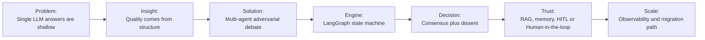
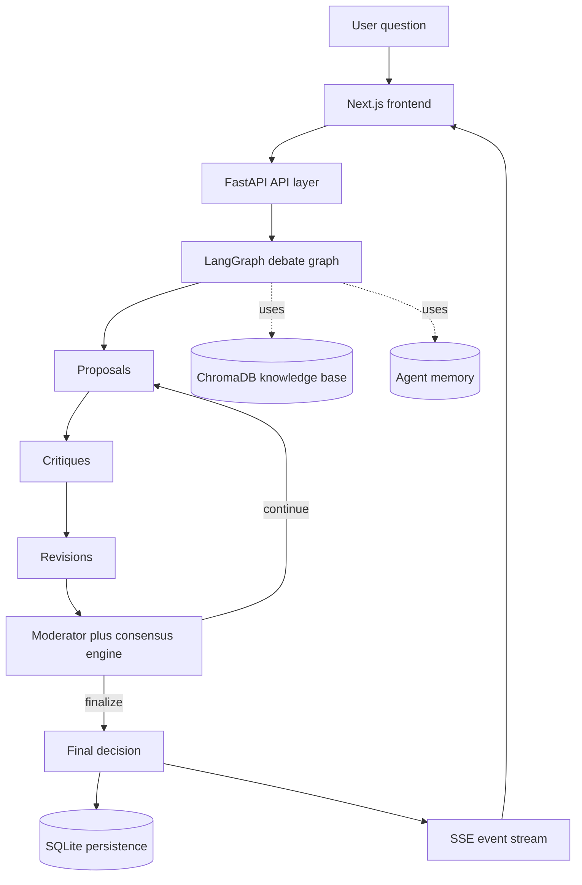
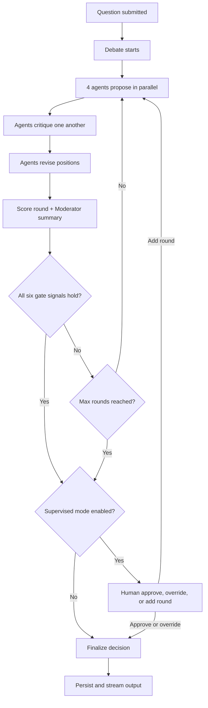

# AgentBoard — The Complete Interview Storyline

> **Purpose:** This document is your single narrative thread for telling the AgentBoard story in any interview. It flows from "why I built it" → "how I designed it" → "what I learned" → "where it goes next." Practise telling each section as a 2-minute story.

## HOW TO USE THIS DOCUMENT

- **First memorise:** Sections 1, 4, 8, 18, and 20. That gives you pitch, architecture, hardest problem, tradeoffs, and scaling.
- **For a 30-second answer:** Use Section 1 only.
- **For a 2-minute answer:** Combine Sections 1, 4, and 8.
- **For a deep technical answer:** Walk through 4 → 6 → 8 → 18 → 20.
- **Interview-safe rule:** Use exact percentages, token counts, and cost numbers only if you can explain how you measured them. Otherwise say they are directional or qualitative observations.

### One-Page Memory Map

Use this as the mental sequence to recall the full story under interview pressure.



---

## TABLE OF CONTENTS

1. [The Opening Hook — Why This Project Exists](#1-the-opening-hook--why-this-project-exists)
2. [The Problem Statement — In Your Own Words](#2-the-problem-statement--in-your-own-words)
3. [The &#34;Aha&#34; Moment — Multi-Agent Debate](#3-the-aha-moment--multi-agent-debate)
4. [Architecture Walkthrough — The Big Picture](#4-architecture-walkthrough--the-big-picture)
5. [The Agent System — Heart of the Engine](#5-the-agent-system--heart-of-the-engine)
6. [The Debate Loop — Step by Step](#6-the-debate-loop--step-by-step)
7. [LangGraph — Why a State Machine](#7-langgraph--why-a-state-machine)
8. [Consensus Evolution — The Hardest Problem I Solved](#8-consensus-evolution--the-hardest-problem-i-solved)
9. [Structured Output — Eliminating Fragility](#9-structured-output--eliminating-fragility)
10. [Streaming Architecture — Real-Time UX](#10-streaming-architecture--real-time-ux)
11. [Human-in-the-Loop — Trust But Verify](#11-human-in-the-loop--trust-but-verify)
12. [Knowledge Base (RAG) — Grounding in Reality](#12-knowledge-base-rag--grounding-in-reality)
13. [Agent Memory — Learning Across Debates](#13-agent-memory--learning-across-debates)
14. [LLM Provider Strategy — Cost vs Quality](#14-llm-provider-strategy--cost-vs-quality)
15. [Frontend — Visualising an AI Debate](#15-frontend--visualising-an-ai-debate)
16. [Testing — How I Validated Non-Deterministic AI](#16-testing--how-i-validated-non-deterministic-ai)
17. [Observability — Seeing Inside the Black Box](#17-observability--seeing-inside-the-black-box)
18. [Design Decisions — Tradeoffs I Made](#18-design-decisions--tradeoffs-i-made)
19. [Challenges &amp; How I Solved Them](#19-challenges--how-i-solved-them)
20. [Production Readiness — What I&#39;d Change at Scale](#20-production-readiness--what-id-change-at-scale)
21. [Key Numbers to Remember](#21-key-numbers-to-remember)
22. [Common Interview Questions &amp; Answers](#22-common-interview-questions--answers)
23. [Story Arcs for Different Interview Types](#23-story-arcs-for-different-interview-types)
24. [Closing Statement](#24-closing-statement)
25. [Theoretical Foundations — The CS Behind the Build](#25-theoretical-foundations--the-cs-behind-the-build)
26. [Failure Modes & Recovery Playbook](#26-failure-modes--recovery-playbook)

---

## 1. THE OPENING HOOK — Why This Project Exists

### The 30-Second Elevator Pitch

> "I built AgentBoard because I was frustrated with how shallow (not deep / surface-level thinking) single LLM calls are for complex decisions. When we ask ChatGPT 'Should my company expand into Europe?', you get a confident-sounding monologue. But in real boardrooms, decisions are challenged — the finance team says one thing, legal says another, the risk team pushes back. So I built a system that simulates that. Five AI agents — an Analyst, Risk Assessor, Strategist, Ethics Guardian, and a Moderator — debate in structured rounds: propose, critique, revise, converge. The whole thing streams live to a Next.js frontend, and the Moderator only stops when measurable consensus (agreement) is reached. The result is dramatically better than a single LLM call."

### Why This Matters (The Motivation Story)

Tell this when asked "Why did you build this?" or "What problem does it solve?":

> "I was working with LLMs and noticed a pattern. You'd ask a complex question, and the model would give you a polished answer — but if you asked it again with a slightly different framing, you'd get a contradictory answer that was equally polished and equally confident. There was no internal pushback, no devil's advocate, no one saying 'Wait, what about the regulatory risk?' or 'That data doesn't support that conclusion.'

> I thought — what if we could simulate the adversarial process that makes human decision-making good? Not just one voice, but multiple constrained perspectives that challenge each other. That's how AgentBoard was born. Each agent is forced to look through one lens only — the Analyst can't propose strategy, the Risk agent can't offer solutions — and they must engage with each other's criticism before the final answer is produced."

### What Makes It Different From AutoGen / CrewAI

> "The key difference is **structured adversarial debate**. AutoGen and CrewAI have agents collaborate — they pass messages around, they help each other. AgentBoard agents **argue**. There's a formal protocol: propose, then cross-examine, then revise under pressure, then measure if they actually agree. And the consensus isn't vibes — it's quantified by blending confidence with how much their positions overlap, behind a six-signal gate that also checks dissent, open critiques, minimum rounds and an ethics veto. Plus, it's a full-stack product with live streaming, persistence, analytics, and human-in-the-loop — not just a Python script."

---

## 2. THE PROBLEM STATEMENT — In Your Own Words

### Frame 1: The Technical Problem

> "Single-shot LLM inference produces plausible but unreliable decision recommendations. The model has no mechanism for self-challenge, no way to identify its own blind spots, and no adversarial pressure to revise weak reasoning."

### Frame 2: The Business Problem

> "Enterprise decision-makers can't trust a single AI recommendation for high-stakes choices like market expansion, regulatory compliance, or resource allocation. They need multiple perspectives considered, risks explicitly called out, and a transparent audit trail of how the recommendation was reached."

### Frame 3: The Research Problem

> "How do you get higher quality outputs from existing LLMs without fine-tuning, without bigger models, without more data? My hypothesis was: **quality emerges from structure, not from scale.** Constrain agents to narrow lenses, force adversarial interaction, measure convergence — and the same model produces dramatically better output."

---

## 3. THE "AHA" MOMENT — Multi-Agent Debate

### The Analogy That Wins Interviews

> "Think of a corporate board meeting. The CFO presents financial projections. The Chief Risk Officer challenges the assumptions. The Head of Strategy proposes pivots. The General Counsel flags compliance risks. And the CEO synthesises it all into a decision. None of them is 'the smartest person in the room' — the quality comes from the **process**, not any single individual. AgentBoard replicates this with AI agents."

### Why Structure > Scale

| Approach                                  | What Happens                                                           | Quality        |
| ----------------------------------------- | ---------------------------------------------------------------------- | -------------- |
| One LLM call                              | Confident monologue, no pushback                                       | Low-Medium     |
| Chain-of-thought prompting                | Better reasoning, still one perspective                                | Medium         |
| Multi-agent chat (AutoGen-style)          | Agents help each other, groupthink risk                                | Medium         |
| **Adversarial debate (AgentBoard)** | **Forced critique, revision under pressure, measured consensus** | **High** |

### The Evidence

In practice, the biggest improvements are:

- Broader coverage across data, risk, strategy, and ethics instead of one blended answer.
- A more defensible final recommendation because every major claim has gone through critique and revision.
- Preserved dissent and minority views, which is closer to how real decision-making works.

If an interviewer asks for hard benchmarks, anchor on the fact that the system includes simulation and evaluation hooks, then present any numeric claims as internal observations unless you have a repeatable benchmark dataset behind them.

---

## 4. ARCHITECTURE WALKTHROUGH — The Big Picture

### Layer Diagram (Draw This on a Whiteboard)

```
┌─────────────────────────────────────────────────────────────┐
│              FRONTEND (Next.js 15 + React 18)               │
│  Home │ Live Debate Viewer │ History │ Compare │ Analytics  │
│              Tailwind CSS │ recharts │ SSE client            │
├─────────────────────────────────────────────────────────────┤
│                     API LAYER (FastAPI)                      │
│  POST /debate/start-async → thread_id                       │
│  GET  /debate/{id}/stream → SSE events                      │
│  POST /debate/{id}/approve → HITL resume                    │
│  GET  /analytics/overview → dashboard KPIs                  │
│  Rate limiting (slowapi) │ Pydantic validation │ CORS       │
├─────────────────────────────────────────────────────────────┤
│            ORCHESTRATION (LangGraph StateGraph)              │
│  proposals → critiques → revisions → convergence → finalize │
│  Conditional edges │ Checkpointing │ HITL interrupts        │
├─────────────────────────────────────────────────────────────┤
│  AGENTS          │  SERVICES            │  DATA LAYER       │
│  BaseAgent (ABC) │  LangChainProvider   │  SQLite (async)   │
│  Analyst         │  ConsensusEngine     │  ChromaDB vectors  │
│  Risk            │  KnowledgeBase (RAG) │  Alembic migrations│
│  Strategy        │  AgentMemory         │  LangGraph checkpts│
│  Ethics          │  Evaluator           │                    │
│  Moderator       │  Simulator           │                    │
│  4 Domain agents │  Exporter            │                    │
└─────────────────────────────────────────────────────────────┘
```

## Architecture Flow Chart

This is the fastest visual to explain the end-to-end system in one pass.



### How to Walk Through This in an Interview

Start from the **user action** and trace the request:

1. "User types a question on the frontend and hits 'Start Debate'"
2. "That's a POST to `/debate/start-async` which validates via Pydantic, creates a `DebateState`, launches a background task, and immediately returns a `thread_id`"
3. "The frontend then subscribes to `GET /debate/{thread_id}/stream` — that's an SSE connection"
4. "In the background, the LangGraph state machine kicks off: proposals → critiques → revisions → convergence check → repeat or finalize"
5. "Each node in the graph emits events that stream live to the frontend"
6. "When the Moderator declares consensus is reached, the final decision is persisted to SQLite and streamed to the client"

### Tech Stack Justification

| Choice               | Why                                                                                                      |
| -------------------- | -------------------------------------------------------------------------------------------------------- |
| **FastAPI**    | Native async, Pydantic integration, SSE support via `StreamingResponse`, automatic OpenAPI docs        |
| **LangGraph**  | State machine with checkpointing, conditional edges, HITL interrupts — exactly what a debate loop needs |
| **LangChain**  | `with_structured_output()` for type-safe LLM responses, multi-provider abstraction                     |
| **Next.js 15** | App Router SSR, React 18 concurrent features, great DX                                                   |
| **SQLite**     | Zero infrastructure for a portfolio project, async via `aiosqlite`                                     |
| **ChromaDB**   | Local vector DB, sub-5ms queries, no cloud dependency                                                    |

---

## 5. THE AGENT SYSTEM — Heart of the Engine

### BaseAgent: The Template Method Pattern

> "The most impactful design pattern in the project is Template Method for agents. The `BaseAgent` abstract class defines the skeleton algorithm for proposal, critique, and revision — including LLM calls, KB enrichment, tool execution, memory injection, and structured output parsing. Subclasses only override three prompt-generation methods. This means adding a new domain agent is literally: write three prompts, register it. Zero boilerplate."

```
BaseAgent (ABC)
├── run()          → orchestrates: build prompt → call LLM → parse output → return
├── critique()     → orchestrates: build critique prompt → call LLM → parse → return
├── revise()       → orchestrates: inject critiques → call LLM → parse revised output → return
│
├── _build_proposal_prompt()    ← ABSTRACT: subclass overrides
├── _build_critique_prompt()    ← ABSTRACT: subclass overrides
├── _build_revision_prompt()    ← ABSTRACT: subclass overrides
│
├── _enrich_with_kb()           → RAG: query ChromaDB, inject retrieved chunks
├── _inject_memory()            → Inject past debate lessons into system prompt
├── _execute_tools()            → Run agent-specific tools (web_search, date, etc.)
└── _call_llm_structured()      → LangChain structured output with retry
```

### The Five Core Agents

| Agent               | Role                               | Constrained Lens                         | Mandated Limits                               | Why This Design                                                    |
| ------------------- | ---------------------------------- | ---------------------------------------- | --------------------------------------------- | ------------------------------------------------------------------ |
| **Analyst**   | Data-driven expert                 | Facts, causality, evidence               | Cannot propose strategy or assess risk        | Forces pure data analysis without jumping to conclusions           |
| **Risk**      | Adversarial critic                 | Failure modes, worst cases               | Cannot offer solutions                        | Forces exhaustive risk identification without premature mitigation |
| **Strategy**  | Actionable planner                 | Competitive positioning, alternatives    | Must acknowledge risks, evaluate alternatives | Forces pragmatic plans grounded in reality                         |
| **Ethics**    | Compliance guardian                | Fairness, regulation, stakeholder impact | VETO power on ethical violations              | Ensures ethical considerations are never trade-offs                |
| **Moderator** | Synthesiser & convergence detector | All positions holistically               | Cannot take sides or advocate                 | Neutral arbiter measures agreement and produces final synthesis    |

### Why Constrained Lenses? The Design Story

> "Early in development, I tried generic agents — 'You are Agent 1, analyze this problem.' The result was five paraphrases of the same answer. Every agent tried to be comprehensive, so they all said similar things. The breakthrough was **constraints**: when you tell the Risk agent 'You MUST NOT propose solutions,' it becomes genuinely adversarial. It finds risks that the Strategy agent missed because the Strategy agent was busy building a plan. Constraint creates diversity, and diversity creates quality."

### Domain Agents (Extensibility Story)

> "The core debate panel is 4 debating agents plus 1 moderator, but I designed the system for extensibility. Phase 3 added domain-specific agents that extend the base roles. For example, `FinancialEthicsAgent` extends `EthicsAgent` with ESG frameworks, fiduciary duty rules, and securities law constraints. `SecurityAgent` extends `RiskAgent` with OWASP categories and infrastructure SPOF analysis. Activating them is a single config change — select a 'domain pack' like healthcare or finance."

| Domain Agent    | Extends | Specialisation                                 |
| --------------- | ------- | ---------------------------------------------- |
| FinancialEthics | Ethics  | ESG, fiduciary duty, securities law            |
| Security        | Risk    | OWASP, attack surfaces, infrastructure SPOF    |
| Compliance      | Analyst | Cross-jurisdiction regulatory analysis         |
| PatientSafety   | Risk    | Clinical risk, patient welfare, medical ethics |

---

## 6. THE DEBATE LOOP — Step by Step

### Debate Loop Flow Chart

If you need to explain the orchestration quickly, use this before the detailed story.



### Tell This as a Story

> "Let me walk you through what happens when someone asks: 'Should our startup pivot from B2C to B2B SaaS?'"

**Round 1 — Proposals (Parallel)**

> "All four agents receive the question simultaneously. The Analyst looks at market data and customer acquisition costs. The Risk agent identifies failure modes: cash runway risk, team capability gaps, customer migration complexity. The Strategist proposes a phased pivot with specific milestones. The Ethics agent flags potential impacts on existing B2C customers who depend on the product. Each produces a structured output with a position, reasoning, assumptions, and a confidence score between 0 and 1."

**Round 1 — Critiques (Cross-Examination)**

> "Now comes the adversarial part. Each agent reads all three other proposals and writes critiques. That's 12 critiques total — each rated by severity: low, medium, high, or critical. The Risk agent might say to the Strategist: 'Your phased pivot assumes you can maintain B2C revenue during transition, but your own data shows a 30% churn rate — this assumption is critical severity.' The Ethics agent might critique the Analyst: 'Your market size analysis ignores the regulatory landscape in EU markets.'"

**Round 1 — Revisions (Under Pressure)**

> "Each agent now receives the critiques directed at them and must revise their position. The Strategist reads the Risk critique about churn assumptions and adjusts: 'Updated plan now includes a 6-month parallel run period with retention incentives.' Confidence scores adjust — some go up (when critiques validated their position), some go down (when they had to make concessions)."

**Round 1 — Convergence Check**

> "The consensus engine scores the revised positions. It blends mean confidence with how much the positions overlap. The Moderator writes a round summary, but it doesn't decide whether to continue. A deterministic six-signal gate does. In round 1 the score is typically around 0.5, and in Standard mode round 1 can't end the debate anyway, because `min_rounds` is 2. So we loop."

**Round 2+ — Narrowing**

> "Each subsequent round, positions get sharper. The Analyst incorporates risk data into their analysis. The Strategist addresses compliance concerns. In Standard mode, round 2 is the last round. If the agreement score clears 0.75 *and* the other five signals hold (at most one dissenter, at most two high-severity critiques that round, agents settled, no Ethics veto), the debate ends as `consensus_reached`. If not, it ends as `max_rounds_reached`, and the report says so instead of faking a consensus. Thorough mode raises the bar to 0.85 and allows 3–6 rounds, so the same gate keeps looping until it passes or the rounds run out. Either way, the Moderator then synthesises the final decision."

**Finalization**

> "The Moderator produces the `FinalDecision`: a recommendation statement, a confidence score, identified risks, alternatives considered, minority dissenting views (if the Ethics agent still had reservations), and the full debate trace. This gets persisted to SQLite and streamed to the frontend."

### The Numbers

```
Typical multi-round debate (thorough/Custom, converging in 3 rounds):
├── Round 1: 4 proposals + 12 critiques + 4 revisions = 20 LLM calls
├── Round 2: Same pattern = 20 more
├── Round 3: 20 more + 1 final synthesis
├── Total: around 60 LLM calls
├── Total tokens: roughly tens of thousands of input/output tokens
├── Time: 45-90 seconds end-to-end (parallel agent execution)
├── Cost on Groq: typically in the low-cent range
└── Note: standard now caps at 2 rounds; thorough allows up to 6, so a full-budget debate costs more
```

---

## 7. LANGGRAPH — Why a State Machine

### The "Why Not Just a For-Loop?" Answer

> "My first version was a `while` loop. `while not converged: run_round()`. It worked, but I hit three problems that made me switch to LangGraph:"

| Problem                       | For-Loop                                   | LangGraph Solution                                                    |
| ----------------------------- | ------------------------------------------ | --------------------------------------------------------------------- |
| **Crash recovery**      | Lose all state, restart from scratch       | Checkpointing after every node — resume from last saved state        |
| **Human-in-the-loop**   | Block the thread forever waiting for input | `interrupt()` pauses execution, persists state, resumes on API call |
| **Conditional routing** | Nested `if/else` spaghetti               | Declarative conditional edges in graph definition                     |
| **Debugging**           | Print statements                           | Time-travel debugging in LangGraph Studio — replay any node          |

### How the Graph Is Built

```python
graph = StateGraph(DebateState)

# Add nodes (each is a closure that captures its dependencies)
graph.add_node("proposals",   make_proposal_node(agents, llm_client))
graph.add_node("critiques",   make_critique_node(agents, llm_client))
graph.add_node("revisions",   make_revision_node(agents, llm_client))
graph.add_node("convergence", make_convergence_node(moderator, consensus_engine))
graph.add_node("finalize",    make_finalize_node(moderator))

# Add edges
graph.add_edge(START, "proposals")
graph.add_edge("proposals", "critiques")   # quick mode skips straight to convergence
graph.add_edge("critiques", "revisions")
graph.add_edge("revisions", "convergence")
graph.add_conditional_edges(
    "convergence",
    route_after_gate,                       # reads should_continue set by the six-signal gate
    {"proposals": "proposals", "hitl": "hitl", "finalize": "finalize"}
)
graph.add_edge("finalize", END)
```

### Node Factory Pattern

> "One pattern I'm proud of is the node factory. LangGraph nodes must be callables that take `(state)` and return updated state. But my nodes need access to agents, the LLM client, the consensus engine. Instead of globals, I use closures: `make_proposal_node(agents, llm_client)` returns a function that has those dependencies captured in its closure scope. It's the Factory pattern applied to state machine nodes."

### State Design

> "The `DebateState` is a TypedDict that flows through the graph. It carries everything: the original question, current round number, all proposals/critiques/revisions indexed by round, the agreement score, the debate mode configuration, and the event replay buffer. Each node reads what it needs and returns only the keys it updated — LangGraph handles the merge."

---

## 8. CONSENSUS EVOLUTION — The Hardest Problem I Solved

### Tell This as Your "Hardest Technical Challenge" Story

> "The hardest problem I solved was measuring when AI agents actually agree. It sounds simple — just check if they said the same thing. But it's not."

#### Attempt 1: Mean Confidence (V1)

> "My first approach was: take the mean of all agents' confidence scores. If everyone is confident, they must agree, right?"

```
agreement_score = mean([analyst.confidence, risk.confidence, strategy.confidence, ethics.confidence])
```

> **The bug:** "In testing, I found a case where the Analyst was 0.9 confident that the company should expand, and the Risk agent was 0.85 confident that it absolutely should NOT. Mean confidence: 0.875 — above the convergence threshold. The system declared consensus when the agents completely disagreed. High confidence ≠ agreement."

#### Attempt 2: Text Overlap + Confidence (V1.5)

> "I added Jaccard word overlap between positions, weighted by confidence."

```
score = Σ(confidence_weight_ij × jaccard(position_i, position_j)) / Σ(weights)
```

> **Better, but:** "Jaccard is bag-of-words. Two agents could say 'We should expand into Europe for growth' and 'We should NOT expand into Europe despite growth potential' — high word overlap, opposite meaning."

#### Attempt 3: Semantic Similarity + Confidence Hybrid (V2, opt-in)

> "Next I tried sentence embeddings. I embedded each agent's position using `all-MiniLM-L6-v2` (384-dimensional vectors), computed pairwise cosine similarity, and blended it with confidence:"

```
semantic_sim = mean(cosine_similarity(embed(pos_i), embed(pos_j)))  for all pairs
hybrid_score = (1 - w) × mean_confidence + w × semantic_similarity     # w = 0.5
```

> "That helps when agents are talking about different things: their embeddings land far apart and the score drops. But it doesn't fix the case that started all this. Sentence embeddings are negation-blind too. 'Should expand' and 'should NOT expand' are almost the same sentence, so they embed close together. So V2 stays opt-in behind `SEMANTIC_CONSENSUS_ENABLED`, and it falls back to the default blend if the model can't load."

#### Attempt 4: Stop Trusting One Number — the Six-Signal Gate

> "The real fix was to stop letting any single score end the debate. The live score blends 0.7 × mean confidence with 0.3 × confidence-weighted word overlap. The overlap is rescaled first (0.08 → 0, 0.19 → 1), because agents writing in different roles share few words even when they agree. That score is only one of six conditions that must all hold: at least `min_rounds` completed, at most one dissenter (an agent more than 0.20 below the group's mean confidence), at most two high or critical critiques raised that round, agents settled (low drift, tight confidence spread, or everyone ≥ 0.90), and no standing Ethics veto. An agent that strongly opposes the others often raises high-severity critiques, and those count against consensus even when the overlap score misses the disagreement."

> "I'm upfront that this *reduces* false consensus rather than solving it. Stance blindness is still a known limitation. The next step would be an NLI contradiction check between positions."

#### Position Drift (One Signal, Not an Early Stop)

> "I also track position drift: how much each agent's wording changed since the last round (1 − Jaccard). Drift below 0.05 is one of three ways agents count as 'settled' for the gate. It doesn't end the debate on its own. If agents stall below the threshold, the debate runs to `max_rounds` and ends `max_rounds_reached`."

### Why This Story Works in Interviews

This demonstrates:

- **Iterative problem-solving** (V1 → V1.5 → V2 → gate, not designing the perfect solution upfront)
- **Finding bugs through testing** (the false consensus discovery)
- **ML knowledge** (embeddings, cosine similarity, hybrid scoring, and where embeddings fail)
- **Pragmatic engineering** (feature flags, graceful fallback, configurability)
- **Honesty about limits** (what the gate still can't catch)

---

## 9. STRUCTURED OUTPUT — Eliminating Fragility

### The Before/After Story

> "Early on, every agent call was followed by a substantial amount of output parsing: regex extraction, JSON.loads with try/except, field validation, and retry logic for malformed output. Some LLM calls still produced unparseable output, and every failure path was a custom handler."

**Before:**

```python
# 40+ lines of fragile extraction
response = await llm.ainvoke(prompt)
try:
    json_match = re.search(r'\{.*\}', response.content, re.DOTALL)
    if json_match:
        data = json.loads(json_match.group())
        position = data.get("position", "")
        confidence = float(data.get("confidence", 0.5))
        # ... normalize, validate, fallback ...
except (json.JSONDecodeError, KeyError, ValueError) as e:
    # ... retry logic, fallback defaults ...
```

**After:**

```python
# 3 lines, guaranteed type safety
class AgentLLMOutput(BaseModel):
    position: str
    reasoning: str
    assumptions: list[str]
    confidence_score: float = Field(ge=0.0, le=1.0)

structured_llm = llm.with_structured_output(AgentLLMOutput, method="function_calling")
result: AgentLLMOutput = await structured_llm.ainvoke(prompt)
```

> "LangChain converts the Pydantic schema into a function-calling schema for the LLM. The model is instructed to call a 'function' with those exact parameters. The output is automatically validated, typed, and retry-wrapped. Zero boilerplate, guaranteed type safety at the LLM boundary."

### Why This Matters

- **Removed a large amount** of parsing/validation/retry boilerplate across agent flows
- **Reduced parsing failures** and made malformed outputs easier to recover from
- **Type safety propagates** — downstream code gets `AgentLLMOutput`, not `dict[str, Any]`
- **New agents** just define their output schema; parsing is automatic

---

## 10. STREAMING ARCHITECTURE — Real-Time UX

### Why SSE Over WebSockets

> "I deliberately chose Server-Sent Events over WebSockets. SSE is unidirectional — server pushes to client — which is exactly our pattern: the debate generates events, the client consumes them. WebSockets would add bidirectional complexity we don't need. SSE also gives us event IDs and simple replay semantics, and the frontend layers heartbeat checks and retry logic on top so reconnects are predictable."

### The Event Pipeline

```
Agent node completes work
  ↓
1. Create event payload (type, data, timestamp)
  ↓
2. Append to in-memory replay buffer (for late joiners)
  ↓
3. Push to asyncio.Queue (one per connected SSE client)
  ↓
4. Persist to SQLite debate_events table (for cross-restart replay)
  ↓
5. StreamingResponse yields event to HTTP client
  ↓
6. Frontend EventSource receives and renders
```

### Event Types

| Event                  | When                    | Payload                                                                             |
| ---------------------- | ----------------------- | ----------------------------------------------------------------------------------- |
| `debate_started`     | Thread created          | `{thread_id, user_query, max_rounds}`                                             |
| `round_started`      | New round begins        | `{round_number, max_rounds}`                                                      |
| `phase_started`      | Phase transition        | `{round_number, phase}`                                                           |
| `agent_output`       | Proposal or revision    | `{round_number, phase, agent_name, position, confidence_score}`                   |
| `critique_completed` | Cross-examination done  | `{round_number, critic_agent, target_agent, severity, critique_points}`           |
| `synthesis`          | Round scored            | `{round_number, agreement_score, summary, agreement_areas, disagreement_areas, confidence_agreement_score, position_agreement_score, semantic_agreement_score}` (no `should_continue`: the gate decides, so the UI never shows the Moderator's conflicting call) |
| `approval_required`  | HITL pause              | `{round_number, agreement_score, termination_reason, synthesis_summary, options}` |
| `debate_completed`   | Debate loop finished    | `{thread_id, termination_reason, total_rounds, agreement_score}`                  |
| `final_decision`     | Final decision streamed | `{FinalDecision JSON}`                                                            |
| `error`              | Failure                 | `{message}`                                                                       |

### Reconnection Strategy

```
Client disconnects (network blip)
  ↓
Frontend reconnects with heartbeat + exponential backoff:
  1s → 2s → 4s → 8s → 16s → 30s (max)
  ↓
Resumes from the last seen event id when available
  ↓
Server replays all events after that ID from buffer/DB
  ↓
Client seamlessly continues rendering
  ↓
After 10 failed attempts → show "Disconnected" status
```

### Frontend Connection Status UI

```
● Connected (green)     — Live event stream active
↺ Reconnecting (amber)  — Auto-retry in progress
✕ Disconnected (red)    — Max retries exceeded, manual refresh needed
```

---

## 11. HUMAN-IN-THE-LOOP — Trust But Verify

### The Story

> "For high-stakes decisions, you don't want a fully autonomous AI. AgentBoard supports supervised mode where the debate runs normally, but before the final decision is committed, it pauses and asks a human to approve, override, or request more rounds."

### How It Works (Technical)

1. User starts debate with `supervised: true`
2. LangGraph debate loop runs normally through rounds
3. When convergence is reached, the `finalize` node calls `interrupt()` — a LangGraph primitive
4. Graph state is checkpointed to SQLite (exact mid-execution state)
5. An `approval_required` SSE event is emitted to the frontend
6. Frontend shows an approval dialog with three options:
   - **Approve**: Accept the decision as-is
   - **Override**: Inject human feedback into the final decision
   - **Add Round**: Increment `max_rounds`, continue debating
7. Human makes choice → `POST /debate/{thread_id}/approve` with the action
8. Backend calls `graph.resume()` — LangGraph loads the exact checkpoint and continues
9. If "Add Round" — debate loops back; if "Approve/Override" — finalize and persist

### Why This Matters

> "This is the 'trust but verify' pattern. The AI does the heavy cognitive lifting — multi-round debate, cross-examination, consensus building — but the human retains final authority. In enterprise settings, this is non-negotiable for compliance-sensitive decisions."

---

## 12. KNOWLEDGE BASE (RAG) — Grounding in Reality

### The Problem RAG Solves

> "Without RAG, agents reason purely from their training data — which has a knowledge cutoff and knows nothing about your company's specific documents, policies, or data. RAG lets users upload documents that get injected as context into every agent's reasoning."

### The Pipeline

```
User uploads PDF/TXT/MD
  ↓
1. Text extraction (pypdf for PDFs, direct read for text)
  ↓
2. Sliding-window chunking: 1000 chars, 200 char overlap
  ↓
3. Embedding: all-MiniLM-L6-v2 → 384-dimensional vectors
  ↓
4. Storage: ChromaDB persistent collection (local disk)
  ↓
At debate time:
  ↓
5. User's question embedded with same model
  ↓
6. Cosine similarity search in ChromaDB
  ↓
7. Top-5 chunks at or above the 0.30 similarity threshold returned
  ↓
8. Injected into each agent's system prompt as numbered context blocks:
   "Relevant context from uploaded documents:
    [1] ... chunk text ...
    [2] ... chunk text ..."
```

### Design Decisions

| Decision        | Choice                            | Why                                                |
| --------------- | --------------------------------- | -------------------------------------------------- |
| Embedding model | `all-MiniLM-L6-v2` (22M params) | Free, local, no API latency, 384-dim is sufficient |
| Chunk size      | 1000 chars, 200 overlap           | Balances context length vs. semantic coherence     |
| Top-K           | 5 chunks                          | Keeps token budget manageable (~500-1000 tokens)   |
| Threshold       | 0.30 cosine similarity            | MiniLM scores run low even for relevant chunks; a permissive floor keeps them, top-5 caps noise |
| Vector DB       | ChromaDB (local)                  | Zero infrastructure, ~5ms queries, works offline   |

### Graceful Degradation

> "If no documents are uploaded, or ChromaDB is unavailable, the `_enrich_with_kb()` method in BaseAgent returns the prompt unchanged. Agents operate normally without KB context — it's additive, never required."

---

## 13. AGENT MEMORY — Learning Across Debates

### The Concept

> "After each debate, each agent's final position is summarised by an LLM into a one-sentence lesson. These lessons are stored in SQLite and, in future debates with memory enabled, each agent's **five most recent** lessons are injected into its system prompt."

*(Honest note: retrieval is by recency, not similarity — retrieving lessons by similarity to the new question is the next improvement.)*

### Why LLM-Summarised?

> "Raw agent positions are ~2000 tokens each. Injecting 5 raw positions from past debates would consume 10,000 tokens of context window. But a one-sentence distilled lesson is ~30 tokens. Five lessons = 150 tokens. Same insight, 98.5% fewer tokens."

### The Flow

```
Debate completes
  ↓
For each agent:
  LLM call: "Summarise your final position on '{question}' in one sentence."
  → "Market expansion into Southeast Asia requires phased entry with local partnerships."
  ↓
Stored in SQLite: agent_memory(agent_name, debate_id, summary, lesson_learned, created_at)

New debate starts (if enable_agent_memory=True):
  ↓
For each agent:
  query agent_memory by agent_name (case-insensitive, indexed) ORDER BY created_at DESC
  → Retrieve the 5 most recent lessons
  ↓
Inject into system prompt:
  "Lessons from your past debates:
   - Market expansion into Southeast Asia requires phased entry...
   - Technology acquisitions should be evaluated on team quality, not just IP..."
```

### Why This Matters

> "This gives agents institutional memory. After 100 debates, the Risk agent has 'seen' 100 different scenarios and carries distilled wisdom into every new debate. Without this, every debate starts from zero."

---

## 14. LLM PROVIDER STRATEGY — Cost vs Quality

### Multi-Provider Architecture

> "AgentBoard uses the Adapter pattern for LLM providers. A `LangChainProvider` class wraps LangChain's ChatGroq, ChatOpenAI, or ChatAnthropic behind a unified interface. Switching providers is a single environment variable change — or a runtime API call."

| Provider            | Model           | Cost Profile | Quality   | Speed Profile | Use Case                                   |
| ------------------- | --------------- | ------------ | --------- | ------------- | ------------------------------------------ |
| **Groq**      | LLaMA 3.3 70B   | Lowest       | Very Good | Very fast     | Default, development                       |
| **OpenAI**    | GPT-4o          | Highest      | Excellent | Fast          | High-stakes synthesis                      |
| **Anthropic** | Claude Sonnet 4 | High         | Excellent | Fast          | Safety-heavy or policy-sensitive use cases |

### Runtime Switching

> "Users can switch providers via `POST /llm-settings` without restarting the server. For Groq, we use a server-side API key from `.env`. For OpenAI/Anthropic, the user supplies their own key — it's held in memory only, never persisted to disk."

### Per-Agent Model Routing (Cost Optimization)

> "Not all agents need the same model quality. The Moderator's synthesis task benefits most from a powerful model. The Analyst's fact-finding is simpler. So we support per-agent model routing: Moderator on GPT-4o ($0.06/output-token), others on Groq/LLaMA ($0.00002/output-token). This can reduce cost 5-10x while maintaining quality where it matters."

### The Cost Story (Great for Business-Focused Interviews)

> "The practical takeaway is that multi-round debate is affordable on Groq-class models, but expensive if every agent uses a premium model. That is why per-agent routing matters: put your best model on the Moderator or other high-leverage steps, and keep cheaper models on routine agent reasoning."

---

## 15. FRONTEND — Visualising an AI Debate

### Pages and Their Purpose

| Page                  | URL                          | What It Shows                       | Key Challenge                                        |
| --------------------- | ---------------------------- | ----------------------------------- | ---------------------------------------------------- |
| **Home**        | `/`                        | Debate input form, template browser | Template categorisation, keyboard shortcuts          |
| **Live Viewer** | `/debate/[threadId]`       | Real-time debate as it happens      | SSE rendering, progressive reveal, connection status |
| **History**     | `/history`                 | Searchable, paginated past debates  | Pagination, search, status badges                    |
| **Compare**     | `/compare?a={id1}&b={id2}` | Side-by-side debate comparison      | URL-based state, alignment of differing structures   |
| **Simulate**    | `/simulate`                | N-debate consistency testing        | Parallel execution visualization                     |
| **Knowledge**   | `/knowledge`               | Upload/manage KB documents          | File upload, status tracking                         |
| **Memory**      | `/memory`                  | Browse agent memory entries         | Per-agent filtering                                  |
| **Analytics**   | `/analytics`               | KPI dashboard with charts           | Data aggregation, recharts visualization             |

### State Management Philosophy

> "I deliberately avoided Redux/Zustand. With React 18, `useReducer` for complex state and `useState` for simple state covers 95% of use cases. Theme is persisted in `localStorage`. The compare page uses URL search params so links are shareable. No state management library = no learning curve for contributors, no overhead."

### Live Debate Viewer (Most Interesting Component)

> "The debate viewer is the most complex frontend component. It connects to SSE, renders agent outputs as they arrive (progressive reveal), shows a confidence drift chart updating in real-time, displays critique/revision cycles per round, and handles reconnection gracefully. The key challenge was rendering partial state — you might have 2 of 4 proposals completed — so the UI uses skeleton loaders for pending agents."

---

## 16. TESTING — How I Validated Non-Deterministic AI

### The Core Challenge

> "Testing AI systems is fundamentally different from testing deterministic code. The same input produces different outputs every run. You can't assert `result == expected_string`. So I developed a testing strategy centered on **structural correctness** and **contract compliance** rather than output matching."

### Testing Strategy: ~520 backend tests (48 modules) + 114 frontend unit + 71 end-to-end

All LLM calls are mocked (or a fake LLM drives the real LangGraph engine), every test runs on throw-away databases, and CI runs lint, mypy and all tests before building images. Each bug fix ships with a test that fails on the old code.

| Test Category                       | What It Validates                                         | Example                                                       |
| ----------------------------------- | --------------------------------------------------------- | ------------------------------------------------------------- |
| **Schema validation**         | Pydantic models accept valid input, reject invalid        | `confidence_score: 1.5` → `ValidationError`              |
| **Agent contracts**           | Agents return correct structure regardless of LLM content | `isinstance(result, AgentLLMOutput)` and all fields present |
| **Consensus math**            | Scoring formulas are deterministic given same inputs      | `V1_score([0.8, 0.7, 0.9, 0.6]) == 0.75` exactly            |
| **State machine transitions** | Graph routes correctly on conditions                      | all six gate signals hold → finalize (not proposals)       |
| **API contracts**             | Endpoints return correct status codes, headers, shapes    | `POST /debate/start → 200`, response has `thread_id`     |
| **Error handling**            | Graceful degradation on failure                           | Agent timeout → debate continues with remaining agents       |
| **Integration**               | End-to-end with mocked LLM                                | Full debate loop produces `FinalDecision`                   |

### Mocking Strategy

> "Every test that touches the LLM uses `unittest.mock.AsyncMock`. I mock `LangChainProvider.ainvoke_structured()` to return valid `AgentLLMOutput` objects. This gives me deterministic tests that run in milliseconds, not dollars."

```python
@pytest.fixture
def mock_llm():
    provider = AsyncMock(spec=LangChainProvider)
    provider.ainvoke_structured.return_value = AgentLLMOutput(
        position="Test position",
        reasoning="Test reasoning",
        assumptions=["Assumption 1"],
        confidence_score=0.85
    )
    return provider
```

### Simulation Testing (Non-Determinism Quantification)

> "Beyond unit tests, I built a Simulator that runs N independent debates (2-5) for the same question and computes the mean pairwise word overlap (Jaccard) of the final decisions, rescaled the same way as the consensus score. This gives a **consistency score**: if it's above 0.80, the question type produces stable results. Below 0.55, the system is unreliable for that category. This is essentially a statistical test for LLM output stability."

### LLM-as-Judge Evaluation (Decision Quality Scoring)

> "The Simulator tells me whether the system is *stable*; the Evaluator tells me whether a single decision is *good*. It's a separate LLM acting as an objective judge — it never participated in the debate, so it has no stake in the outcome. It reads the final decision and scores it on four dimensions, each 0.0–1.0:"

| Dimension          | Question it answers                                                  |
| ------------------ | ------------------------------------------------------------------- |
| **completeness**   | Does the decision address *all* aspects of the original query?      |
| **consistency**    | Is it internally coherent, with no factual contradictions?          |
| **actionability**  | Does it contain concrete, implementable next steps — not platitudes? |
| **risk_awareness** | Are the relevant risks clearly identified and addressed?            |

> "The judge is prompted to be calibrated and critical — 0.9–1.0 is excellent, 0.7–0.8 good, 0.5–0.6 adequate, below 0.5 poor — and it must justify the scores with a one-paragraph `reasoning` that cites evidence from the decision text. The `overall` score is the mean of the four. It uses the same `with_structured_output()` pattern as the agents (a Pydantic `EvaluationLLMOutput` schema), so the scores come back type-safe and validated. To keep it cheap, the result is cached in the `decisions.evaluation_json` column — I never re-judge the same decision twice."

> **Why it matters in interviews:** "This is the third layer of my quality story. Adversarial critique catches weak claims *during* the debate, RAG grounds agents in real documents, and the LLM-as-judge gives an *after-the-fact* quality score I can track, surface in the UI, and aggregate in analytics. Using an LLM to judge another LLM's output is the same idea behind frameworks like G-Eval — cheaper and more scalable than human grading, while staying calibrated through an explicit rubric." *(Implementation: `backend/app/services/evaluator.py`.)*

---

## 17. OBSERVABILITY — Seeing Inside the Black Box

### Structured JSON Logging

> "Every log line is emitted as JSON with context variables: timestamp, level, message, and structured extras like `thread_id`, `agent_name`, `round`, `latency_ms`. This makes logs parseable by ELK/Datadog without regex extraction."

### Correlation ID (X-Request-ID)

> "Every HTTP response includes an `X-Request-ID` header. This ID propagates through the debate execution, so you can trace a single user request through API → graph execution → all agent calls → DB persistence. Essential for debugging production issues."

### Metrics Tracked

| Metric                  | Type                         | What It Tells You                                |
| ----------------------- | ---------------------------- | ------------------------------------------------ |
| `request_count`       | Counter (method/path/status) | API traffic patterns, error rates                |
| `request_duration_ms` | Histogram                    | API latency distribution                         |
| `debate_rounds`       | Histogram                    | How many rounds to converge (quality signal)     |
| `agent_response_time` | Histogram (per-agent)        | Which agents are slow, LLM latency               |
| `consensus_score`     | Gauge                        | Distribution of agreement scores                 |
| `completion_rate`     | Ratio                        | Debates completed vs. total (reliability signal) |

### LangSmith Integration (Optional)

> "For deep LLM debugging, I integrated LangSmith tracing. Set `LANGSMITH_TRACING=true` and every LLM call is traced: input/output tokens, latency, model, full prompt text. You can visualise the entire debate graph execution in LangSmith's dashboard — incredibly useful for optimising prompts."

---

## 18. DESIGN DECISIONS — Tradeoffs I Made

### The Master Decision Table

Use this when asked "Tell me about a design decision you made" or "What tradeoffs did you make?":

| Decision                 | I Chose                               | Over                       | Reason                                     | Tradeoff I Accepted                      |
| ------------------------ | ------------------------------------- | -------------------------- | ------------------------------------------ | ---------------------------------------- |
| **Orchestration**  | LangGraph StateGraph                  | `while` loop             | Checkpointing, HITL, conditional routing   | Added complexity, learning curve         |
| **Streaming**      | SSE                                   | WebSockets                 | Simpler, auto-reconnect, unidirectional    | Can't send client→server mid-debate     |
| **LLM Output**     | Pydantic `with_structured_output()` | JSON parsing regex         | Type-safe, zero boilerplate                | Requires function-calling capable models |
| **Database**       | SQLite                                | PostgreSQL                 | Zero infrastructure, portfolio-appropriate | Single-process write bottleneck          |
| **Vectors**        | ChromaDB (local)                      | Pinecone (cloud)           | Free, fast, offline                        | Single-machine, no managed service       |
| **Embeddings**     | sentence-transformers (local)         | OpenAI embeddings API      | No cost, no latency                        | Slightly lower quality                   |
| **Agent pattern**  | Class-per-agent                       | Configurable generic agent | Type safety, custom logic, testable        | More classes to maintain                 |
| **State**          | In-memory + async DB                  | Pure DB                    | Sub-ms SSE access                          | State lost on crash (DB as backup)       |
| **Consensus**      | Deterministic + LLM advisory          | Pure LLM-judged            | Guaranteed termination, testable           | Less nuanced than LLM scoring            |
| **Data access**    | Raw SQL + Alembic                     | ORM (SQLAlchemy models)    | Simple 4-table model, JSON blob storage    | No relationship mapping                  |
| **Frontend state** | `useReducer` + `useState`         | Redux/Zustand              | Simpler, fewer dependencies                | No time-travel debugging                 |

### How to Present a Decision

Use this framework for any decision:

1. **Context:** "We needed X because..."
2. **Options considered:** "I evaluated A, B, and C..."
3. **Decision:** "I chose B because..."
4. **Tradeoff acknowledged:** "The downside is... and I mitigated it by..."
5. **Outcome:** "In practice, this worked well because..."

---

## 19. CHALLENGES & HOW I SOLVED THEM

### Challenge 1: False Consensus (V1 → V2 Evolution)

*See [Section 8](#8-consensus-evolution--the-hardest-problem-i-solved) for the full story*

### Challenge 2: Agent Timeout Handling

> **Problem:** Some LLM calls take 20-30 seconds, especially with complex prompts on slower providers. If one agent times out, the entire debate stalls.

> **Solution:** Each agent call has a per-phase `asyncio.wait_for` timeout (45 s by default; tool-using agents get a 1.5× multiplier). If an agent times out, their proposal is recorded as a timeout event, and the debate continues with the remaining agents. The Moderator accounts for missing agents in its synthesis. This is graceful degradation — a 3-agent debate is better than a failed one.

### Challenge 3: Structured Output Failures

> **Problem:** Even with `with_structured_output()`, some models occasionally produce malformed responses.

> **Solution:** Built-in retry with `stop_after_attempt(2)`. If both attempts fail, return `None` and the orchestrator handles it (skip that agent's output for this phase). Logged as a warning with full payload for debugging.

### Challenge 4: SSE Connection Lifecycle

> **Problem:** Long-running SSE connections (debates can take 90+ seconds) get dropped by proxies, load balancers, or browser idle timeouts.

> **Solution:** Heartbeat every 30 seconds (SSE comment `: keepalive`), `request.is_disconnected()` check before each write, and client-side `EventSource` with exponential backoff reconnection. The replay buffer ensures no events are lost on reconnect.

### Challenge 5: Concurrent Debate State Isolation

> **Problem:** Multiple debates running simultaneously could interfere with each other's state.

> **Solution:** Each debate gets a unique `thread_id` (UUID). LangGraph scopes all state by `thread_id`. The in-memory event buffer is keyed by `thread_id`. SQLite queries filter by `thread_id`. An `asyncio.Lock` per thread prevents race conditions on individual debate state.

### Challenge 6: Token Budget Management

> **Problem:** With KB context, agent memory, tool results, and critique history, the prompt can easily exceed context window limits.

> **Solution:** Hard caps at each injection point: KB capped at 5 chunks (~1000 tokens), tools at 2KB, memory at 5 lessons (~150 tokens), critique summaries truncated. Total system prompt stays under 4,000 tokens, leaving room for model output.

### Challenge 7: Generic Agents Problem

> **Problem:** Initial agents without role constraints produced five paraphrases of the same answer — no diversity, no adversarial value.

> **Solution:** Mandated constraints in system prompts: "You MUST focus exclusively on X. You MUST NOT do Y." The Risk agent is forbidden from proposing solutions. The Analyst can't make strategic recommendations. Constraints force genuine perspective diversity.

---

## 20. PRODUCTION READINESS — What I'd Change at Scale

### Current State (Honest Assessment)

| Area                    | Current                | Production Need                 | Migration                                              |
| ----------------------- | ---------------------- | ------------------------------- | ------------------------------------------------------ |
| **Database**      | SQLite (single-writer) | PostgreSQL (concurrent writes)  | Replace `aiosqlite` with `asyncpg`, update queries |
| **State**         | In-memory dicts        | Redis (shared across instances) | Serialize to Redis, use Redis pub/sub for SSE          |
| **Vectors**       | ChromaDB (local)       | Pinecone or pgvector            | Swap `_ingest_sync`/`_retrieve_sync` methods       |
| **Tasks**         | `BackgroundTasks`    | Celery + Redis broker           | Durable task execution with retry/DLQ                  |
| **Auth**          | None                   | JWT/OAuth2 + RBAC               | Add auth middleware, permission decorators             |
| **Secrets**       | `.env` file          | AWS SSM / HashiCorp Vault       | Environment-based secret injection                     |
| **Rate limiting** | In-memory (slowapi)    | Redis-backed (distributed)      | Change slowapi storage backend                         |
| **CORS**          | Wide open (`*`)      | Restrict to frontend domain     | Update `CORS_ORIGINS` list                           |
| **Monitoring**    | Structured logs        | OpenTelemetry + Datadog/Grafana | Add tracing instrumentation                            |

### Scaling Architecture (Whiteboard-Ready)

```
                    ┌─────────────┐
                    │   CDN/ALB   │
                    └──────┬──────┘
                           │
              ┌────────────┼────────────┐
              │            │            │
        ┌─────▼─────┐ ┌───▼─────┐ ┌───▼─────┐
        │ FastAPI #1 │ │ FastAPI #2│ │ FastAPI #3│
        └─────┬─────┘ └───┬─────┘ └───┬─────┘
              │            │            │
              └────────────┼────────────┘
                           │
                    ┌──────▼──────┐
                    │    Redis    │ ← state, pub/sub, rate limiting, SSE fan-out
                    └──────┬──────┘
                           │
              ┌────────────┼────────────┐
              │            │            │
        ┌─────▼─────┐ ┌───▼─────┐ ┌───▼─────┐
        │ Celery #1  │ │ Celery #2│ │ Celery #3│  ← debate execution workers
        └─────┬─────┘ └───┬─────┘ └───┬─────┘
              │            │            │
              └────────────┼────────────┘
                           │
              ┌────────────┼────────────┐
              │            │            │
        ┌─────▼─────┐ ┌───▼─────┐ ┌───▼─────┐
        │ PostgreSQL │ │ Pinecone │ │ LLM APIs │
        └───────────┘ └─────────┘ └─────────┘
```

### How to Talk About This in Interviews

> "I built AgentBoard as a portfolio project, so I deliberately chose technologies that minimize infrastructure: SQLite, ChromaDB, in-memory state. But I designed the architecture for replacement. Every storage dependency is behind an abstraction boundary. Swapping SQLite for PostgreSQL is a driver change + query updates — the API layer never knows. Swapping ChromaDB for Pinecone is changing two methods in the KnowledgeBase service. The adapter pattern for LLM providers means adding a new provider is one class."

---

## 21. KEY NUMBERS TO REMEMBER

### Architecture Numbers

| Metric                 | Value                                                                                          |
| ---------------------- | ---------------------------------------------------------------------------------------------- |
| Core agents            | 5 (Analyst, Risk, Strategy, Ethics, Moderator)                                                 |
| Domain agents          | 4 (FinancialEthics, Security, Compliance, PatientSafety)                                       |
| API endpoints          | 27 current routes across debate, decision, history, analytics, knowledge, memory, and settings |
| Frontend pages         | 8 (Home, Debate, History, Compare, Simulate, Knowledge, Memory, Analytics)                     |
| React components       | 21 top-level components in `frontend/src/components` (+ 6 `ui/` primitives)                  |
| Database tables        | 4 (debates, decisions, debate_events, agent_memory)                                            |
| Evaluation dimensions  | 4 (completeness, consistency, actionability, risk_awareness) scored by an LLM-as-judge          |
| Unit/integration tests | 293 in the current backend suite (18 test files)                                              |
| Backend dependencies   | FastAPI, LangGraph, LangChain, aiosqlite, ChromaDB, sentence-transformers                      |

### Debate Numbers

| Metric                                | Value                                                                            |
| ------------------------------------- | -------------------------------------------------------------------------------- |
| LLM calls per multi-round debate      | Around 60 for a 3-round run (thorough/Custom); standard caps at 2 rounds, thorough at 6 |
| Output tokens per debate              | Typically tens of thousands, depending on prompt size and rounds                 |
| Time to converge                      | 45-90 seconds                                                                    |
| Convergence pattern (illustrative)    | Round 1: ~0.5 → Round 2: ~0.65; Standard stops at round 2 (consensus only if all six signals hold), Thorough keeps going to 0.85 |
| Cost per debate                       | Low on Groq-class models; materially higher on premium models                    |
| Agent timeout                         | 45 seconds per phase (tool-using agents get a 1.5× multiplier)                   |
| Quick mode savings                    | Materially fewer LLM calls because critiques are skipped                         |

### ML Numbers

| Metric                     | Value                                   |
| -------------------------- | --------------------------------------- |
| Embedding model            | all-MiniLM-L6-v2 (22M params, 384 dims) |
| RAG chunk size             | 1000 chars, 200 overlap                 |
| RAG top-K                  | 5 chunks                                |
| RAG similarity threshold   | 0.30 cosine similarity                  |
| Memory lessons injected    | Up to 5 per agent                       |
| Stagnation drift threshold | 0.05 (1 − Jaccard); one way to pass "converged", not an early stop |
| Live score weights         | 0.7 confidence + 0.3 rescaled overlap (0.08 → 0, 0.19 → 1) |
| V2 consensus weight        | 0.5 (configurable, opt-in)              |

---

## 22. COMMON INTERVIEW QUESTIONS & ANSWERS

### "Tell me about a project you've built."

> *Use [Section 1 — Opening Hook](#1-the-opening-hook--why-this-project-exists). 30-second elevator pitch, then offer to go deeper into any area.*

### "What was the hardest technical challenge?"

> *Use [Section 8 — Consensus Evolution](#8-consensus-evolution--the-hardest-problem-i-solved). Tell the V1 → V1.5 → V2 → six-signal gate story, including what it still can't catch.*

### "How do you handle errors / edge cases?"

> *Use [Section 19 — Challenges](#19-challenges--how-i-solved-them). Pick 2-3: timeout handling, structured output failures, SSE lifecycle.*

### "Walk me through the architecture."

> *Use [Section 4 — Architecture Walkthrough](#4-architecture-walkthrough--the-big-picture). Draw the layer diagram, then trace a request end-to-end.*

### "Why did you choose [technology X]?"

> *Use [Section 18 — Design Decisions](#18-design-decisions--tradeoffs-i-made). Use the 5-step framework: Context → Options → Decision → Tradeoff → Outcome.*

### "How would you scale this?"

> *Use [Section 20 — Production Readiness](#20-production-readiness--what-id-change-at-scale). Start with honest current limitations, then layered migration path.*

### "How do you test AI systems?"

> *Use [Section 16 — Testing](#16-testing--how-i-validated-non-deterministic-ai). Emphasize structural validation over output matching.*

### "What design patterns did you use?"

> - **Template Method** (BaseAgent — skeleton in base, prompts in subclasses)
> - **Adapter** (LangChainProvider — multi-provider LLM abstraction)
> - **Factory** (Node factories — closures capture dependencies for LangGraph)
> - **State Machine** (LangGraph StateGraph — typed state, conditional edges)
> - **Service Locator** (AgentRegistry — decouple agent creation)
> - **Graceful Degradation** (timeouts, parse failures, missing KB — never crash)

### "What would you do differently if starting over?"

> - "Start with PostgreSQL from day 1 — SQLite's single-writer limitation was fine for development but limits horizontal scaling"
> - "Add authentication earlier — retrofitting auth is harder than building it in"
> - "Use WebSockets for bidirectional features like mid-debate human injection, while keeping SSE for the unidirectional stream"
> - "Build a proper prompt management system — prompts are currently in-code strings, should be versioned and A/B testable"

### "How do you ensure the AI doesn't hallucinate?"

> "Three layers: (1) RAG grounds agents in uploaded documents instead of pure training data. (2) Adversarial critique — other agents challenge unsupported claims. (3) An LLM-as-judge Evaluator scores final decisions on completeness, consistency, actionability, and risk_awareness. Hallucination isn't eliminated but is dramatically reduced because a hallucinated claim in one agent's output gets critiqued by three others."

### "How do you know if a decision the system produces is actually any good?"

> *This is the question that separates "I wired up some agents" from "I built an evaluated system." Answer it in four beats: the problem, the approach, why it's trustworthy, and the honest limitation.*

**1. The problem — you can't `assert ==` on a decision.**

> "The output is free-form natural language and non-deterministic, so there's no golden string to compare against. 'It ran without crashing' tells me nothing about whether the *recommendation* was good. I needed a quality signal that works on open-ended text."

**2. The approach — a separate LLM acts as an objective judge (LLM-as-judge).**

> "After a debate finalizes, a dedicated Evaluator LLM — one that never took part in the debate, so it has no stake in the outcome — reads the final decision and scores it on four dimensions, each 0.0–1.0:"

| Dimension          | What it checks                                                       |
| ------------------ | ------------------------------------------------------------------- |
| **completeness**   | Does the decision address *all* aspects of the original query?      |
| **consistency**    | Is it internally coherent, with no factual contradictions?          |
| **actionability**  | Does it contain concrete, implementable next steps — not platitudes? |
| **risk_awareness** | Are the relevant risks clearly identified and addressed?            |

> "The `overall` score is the mean of the four. Critically, the judge can't just emit numbers — it must return a one-paragraph `reasoning` that cites evidence from the decision text, so the score is auditable, not a black box."

**3. Why it's trustworthy and cheap, not hand-wavy.**

> "Three engineering details make it reliable: (a) an **explicit rubric** in the system prompt with calibrated bands — 0.9–1.0 excellent down to <0.5 poor — so scores mean the same thing across runs; (b) **structured output** via the same `with_structured_output()` Pydantic pattern as my agents, so every score is validated to be a float in `[0,1]` — the judge physically can't return malformed data; and (c) the result is **cached in `decisions.evaluation_json`**, so I never pay to re-judge the same decision twice. It's the same idea behind frameworks like G-Eval — far cheaper and more scalable than human grading."

**4. The honest limitation (the senior signal).**

> "LLM-as-judge has known biases — models can show self-preference, positional bias, and leniency. I treat the score as a *directional quality signal I can track and aggregate in analytics*, not ground truth. The way I'd harden it is a calibrated judge validated against a small set of human-labelled decisions, and ideally a different model family as judge than the one that debated, to reduce self-preference. That separation of 'who decides' from 'who grades' is the whole point." *(Implementation: `backend/app/services/evaluator.py`; see [Section 16](#16-testing--how-i-validated-non-deterministic-ai).)*

### "Why multi-agent instead of chain-of-thought?"

> "Chain-of-thought improves reasoning within one perspective. Multi-agent debate improves reasoning across perspectives. A single model doing chain-of-thought on 'Should we expand into Europe?' will reason deeply about one angle. Five constrained agents will cover market data, risk, strategy, ethics, and synthesis — angles that a single model consistently misses. Quality comes from the structure of diverse perspectives, not deeper thinking on one."

### "How does the system handle disagreement?"

> "Disagreement is a *feature*, not a bug. If agents disagree after max rounds, the Moderator preserves the dissent as 'minority views' in the final decision. The Ethics agent's VETO power can halt a decision entirely. The agreement score tells the user how strongly the agents converge. A decision with agreement score 0.6 is flagged as 'low confidence — significant dissent' vs. 0.9 which is 'strong consensus.' Transparency over false certainty."

---

## 23. STORY ARCS FOR DIFFERENT INTERVIEW TYPES

### For Backend / Systems Design Interviews

Focus on:

- Architecture layers and request flow ([Section 4](#4-architecture-walkthrough--the-big-picture))
- LangGraph state machine design ([Section 7](#7-langgraph--why-a-state-machine))
- SSE streaming pipeline ([Section 10](#10-streaming-architecture--real-time-ux))
- Concurrency (asyncio, per-thread locks, parallel agent execution)
- Production scaling path ([Section 20](#20-production-readiness--what-id-change-at-scale))

### For ML / AI Engineering Interviews

Focus on:

- Multi-agent debate framework ([Section 5](#5-the-agent-system--heart-of-the-engine), [Section 6](#6-the-debate-loop--step-by-step))
- Consensus mechanism evolution with embeddings ([Section 8](#8-consensus-evolution--the-hardest-problem-i-solved))
- RAG pipeline and chunking strategy ([Section 12](#12-knowledge-base-rag--grounding-in-reality))
- LLM-as-Judge evaluation ([Section 16](#16-testing--how-i-validated-non-deterministic-ai))
- Agent memory with embedding retrieval ([Section 13](#13-agent-memory--learning-across-debates))
- Hallucination mitigation (adversarial critique + RAG)

### For Full-Stack / Product Engineer Interviews

Focus on:

- End-to-end request flow from frontend to decision ([Section 6](#6-the-debate-loop--step-by-step))
- Real-time UX with SSE ([Section 10](#10-streaming-architecture--real-time-ux), [Section 15](#15-frontend--visualising-an-ai-debate))
- Frontend component architecture ([Section 15](#15-frontend--visualising-an-ai-debate))
- API design across 25 endpoints ([Section 4](#4-architecture-walkthrough--the-big-picture))
- Testing non-deterministic systems ([Section 16](#16-testing--how-i-validated-non-deterministic-ai))

### For Staff / Senior Engineer Interviews

Focus on:

- Design decision tradeoffs ([Section 18](#18-design-decisions--tradeoffs-i-made))
- Iterative problem-solving (V1 → V2 consensus story)
- Production readiness awareness ([Section 20](#20-production-readiness--what-id-change-at-scale))
- Cost engineering and optimization ([Section 14](#14-llm-provider-strategy--cost-vs-quality))
- Observability and debugging strategy ([Section 17](#17-observability--seeing-inside-the-black-box))
- "What would you change?" self-awareness

### For Startup / Generalist Interviews

Focus on:

- Problem motivation and market insight ([Section 1](#1-the-opening-hook--why-this-project-exists), [Section 2](#2-the-problem-statement--in-your-own-words))
- End-to-end ownership (backend + frontend + ML + ops)
- Cost-consciousness ([Section 14](#14-llm-provider-strategy--cost-vs-quality))
- Speed of iteration (built in phases, launched fast)
- User-facing polish (live streaming, reconnection, HITL)

---

## 24. CLOSING STATEMENT

### Your Final Impression

> "AgentBoard taught me that building with LLMs isn't just about calling an API — it's about designing **processes** that extract reliable, multi-perspective intelligence from inherently non-deterministic models. The most important engineering isn't in the code — it's in the constraints I imposed on agents, the adversarial structure I designed, and the measurable convergence criteria I iterated to get right. Every design decision has a tradeoff I can articulate, every challenge has a solution I implemented, and every limitation has a migration path I've mapped out."

### One-Liner for LinkedIn / Resume

> "Built AgentBoard: a full-stack multi-agent AI debate engine where 5 specialised LLM agents propose, cross-examine, and converge on consensus decisions through structured adversarial rounds — with real-time SSE streaming, RAG-grounded knowledge, and human-in-the-loop approval."

---

## 25. THEORETICAL FOUNDATIONS — The CS Behind the Build

> Use this when the interviewer stops asking *what* you built and starts asking *why the approach is sound*. The goal is to **name the concept**, explain it in one breath, then tie it back to a concrete AgentBoard decision. Naming the theory signals you didn't just wire libraries together — you understood the fundamentals.

### Why an ensemble of agents works (and when it doesn't)

> "The whole premise rests on **ensemble theory**: a group of *diverse, independent* estimators has lower error than any single one, because their random errors cancel when you aggregate. It's the same math behind random forests and the **Condorcet Jury Theorem** — add independent better-than-chance voters and majority accuracy climbs toward 1. The catch is the word *independent*. Five raw LLM agents aren't independent — they're the same model, so they produce correlated answers and the ensemble buys you nothing. That's the insight that drove my whole agent design: I had to **engineer diversity** with hard role constraints. Diversity isn't free; it's the thing you build."

### Consensus is a measurement problem, not a coordination problem

> "People hear 'consensus' and think Paxos or Raft — getting N machines to agree on one value despite crashes. That's not my problem. Mine is **measuring agreement**: *how much* do these positions actually overlap, and can I trust that agreement? So I built it as a score behind a **multi-signal quorum gate**. Six conditions must all hold: position overlap, a minimum number of rounds, few dissenters, few high-severity critiques that round, agents settled (low drift, tight confidence spread, or all highly confident), and no standing ethics veto. The principle is that any single signal is gameable — high confidence especially, because an LLM's confidence is **not** a probability of being correct. Requiring several independent signals is the same instinct as a quorum: don't let one vote decide."

### Why a state machine instead of a for-loop

> "A debate is a workflow with branches, loops, and a pause point. You *can* write that as a `while` loop, but you lose the things that matter at scale: **checkpointing** (persist state at each step so you can pause and resume), **deterministic control flow wrapped around non-deterministic work**, and clean conditional routing. Modeling it as a **state graph** separates the *control plane* — what runs next — from the *data plane* — the single evolving `DebateState`. That separation is what made human-in-the-loop almost free: I just route through a dedicated node that calls `interrupt()`, and LangGraph's checkpointer handles the resume."

### Concurrency: fan-out, fan-in, and the timeout that saves you

> "LLM calls are **I/O-bound** — you're waiting on a network, not burning CPU — so the right model is an **async event loop**, not threads. Inside each phase I **fan out** all agents with `asyncio.gather` and **fan in** when they're all done. The non-negotiable detail is that every call is individually **timeout-bounded** with `asyncio.wait_for`. That single decision is what turns 'one slow agent freezes the whole debate' into 'one slow agent is dropped and the show goes on.' Cancellation is the same idea in reverse — cancelling a debate raises `CancelledError` in the runner, which I catch to mark it cancelled and emit a final event cleanly."

### Embeddings and RAG in one breath

> "An **embedding** turns text into a vector where *distance is meaning* — semantically similar text lands close together, measured by **cosine similarity**. RAG is just: chunk the docs, embed them, and at query time retrieve the **top-k nearest** chunks above a similarity threshold and hand them to the model as grounding. It fights hallucination by giving the agent *facts to cite* instead of trusting its parametric memory. I used `all-MiniLM-L6-v2` — 384 dimensions, runs on CPU — because retrieval is a **quality-vs-latency tradeoff** and you don't need a giant model to find the right paragraph."

### The reliability mindset: isolate, degrade, recover

> "Three patterns show up everywhere in the codebase. **Timeouts + bulkheads** isolate failures to one call. **Graceful degradation** means a missing agent or an empty knowledge base produces a weaker answer, never a crash — RAG is an enhancement, not a dependency. And **retry with exponential backoff** absorbs transient failures and backend cold starts. If you remember one sentence about my engineering philosophy: *every external dependency is timeout-bounded and has a fallback.*"

### One eventual-consistency tradeoff worth defending

> "I run a **dual store** — an in-memory store that's authoritative for the *active* debate, and fire-and-forget SQLite persistence for history and recovery. That's a deliberate **eventual-consistency** choice: persistence can lag by milliseconds because the live debate is served from memory, so a slow or failed write is logged, never blocking. In CAP terms, for a single-node MVP I'm favouring the latency and availability of the live path over strict durability of every event — and I can articulate exactly what I'd change (Postgres + an outbox) when that tradeoff stops being acceptable."

---

## 26. FAILURE MODES & RECOVERY PLAYBOOK

> **This is the section that separates juniors from seniors in an interview.** Anyone can demo the happy path. When someone asks *"what happens when the LLM times out / returns garbage / the stream drops?"*, you want a crisp, structured answer. The pattern for every answer below is the same four beats: **what breaks → why → how the system copes today → how I'd harden it.** Lead with graceful degradation, end with the production upgrade.

### The 30-second umbrella answer (say this first)

> "My failure philosophy is **isolate, degrade, recover**. Every external call is timeout-bounded, so a failure is contained to one agent or one request. The system degrades gracefully — a missing agent, empty knowledge base, or dropped stream gives a weaker result, not a crash. And it recovers — structured-output retries, SSE replay plus a REST fallback, cold-start backoff, and LangGraph checkpoints. The honest limitation is that it's single-node, and I can walk you through the durable-queue-plus-Postgres version."

### LLM-layer failures

| What breaks | How AgentBoard copes today | How I'd harden it |
|---|---|---|
| **Agent call times out** (slow provider / huge prompt) | `asyncio.wait_for` (45 s; tool agents 1.5×) → emit `agent_timeout`, drop that agent, Moderator notes the round is degraded | Adaptive per-provider timeouts; speculatively re-issue to a faster fallback model |
| **Malformed structured output** | `with_structured_output()` + retry `stop_after_attempt(2)` → on double failure return `None` and skip that agent (logged with payload) | A third "repair" attempt that feeds the bad output back with the schema |
| **Provider 400s on sampling params** (Opus 4.7+/Fable, `gpt-5*` reject `temperature`) | `_sampling_kwargs()` omits `temperature` for those models so the call never 400s | Central per-model capability registry that strips unsupported params |
| **Rate limit / 429** | Raised as `LLMRateLimitError` with a dedicated handler → clean 429; frontend `withRetry` backs off | Client-side token-bucket limiter + request queue + multi-key rotation |
| **Every agent fails in a phase** | No outputs → surfaced as an error rather than fabricating a decision | Circuit breaker: after K consecutive provider failures, fail fast with a clear message |

### Orchestration-layer failures

| What breaks | How AgentBoard copes today | How I'd harden it |
|---|---|---|
| **False consensus** (agreement reported for opposed views) | Six-signal hybrid gate — confidence alone can't converge; reduces it, but negation ("should" vs "should NOT") still fools word overlap and embeddings | NLI contradiction check; calibrated agreement model trained on labelled debates |
| **Never converges** | Hard `max_rounds` ceiling → honest `max_rounds_reached`, decision still produced with low agreement | Adaptive round budget by question difficulty; escalate to HITL |
| **Stagnation** (positions stop moving, threshold unmet) | No standalone early stop: drift < 0.05 only passes the "converged" signal, so a stall below threshold runs to `max_rounds` (`max_rounds_reached`) | Early-stop a true stall; distinguish it from oscillation |
| **Concurrent debates interfere** | Unique `thread_id` scopes graph state, event buffer, and DB rows; per-thread `asyncio.Lock` | Move shared state to Redis/Postgres keyed by `thread_id` for multi-worker scale |
| **Prompt exceeds context window** | Hard caps at every injection point (KB ≤ 5 chunks, tools ≤ 2 KB, memory ≤ 5 lessons) | Pre-flight token counting; summarise-then-inject when over budget |

### Streaming & frontend failures

| What breaks | How AgentBoard copes today | How I'd harden it |
|---|---|---|
| **SSE connection dropped** | Heartbeats + `EventSource` auto-reconnect with backoff + **replay buffer** so no events are lost | Resume-from-cursor via `Last-Event-ID` |
| **SSE keeps failing** | Backoff 1 → 30 s, then after 10 failures a **"Connection lost"** view with an in-place Reconnect (the debate keeps running server-side); finished debates load from REST regardless | Switch transport (polling / WebSocket) based on a connection-health score |
| **Backend cold start** (free-tier, heavy imports) | `withRetry` exponential backoff; health dot backs off and recovers on success | Warm-up ping / keep-alive; lazy-load heavy deps |
| **Zombie SSE generators** | `request.is_disconnected()` checked at least every 20 s (the `ping` interval); the Next.js proxy forwards the browser's abort; replay buffers freed when a debate ends | Central connection registry with TTL eviction |

### Data & infrastructure failures

| What breaks | How AgentBoard copes today | How I'd harden it |
|---|---|---|
| **SQLite write fails / slow** | WAL mode (readers don't block writers); event writes retry when the DB is busy; state snapshots are best-effort; the decision is stored **before** checkpoints are deleted, so a failed save stays resumable | Outbox pattern + retry queue; Postgres with pooling |
| **Process crash mid-debate** | LangGraph checkpointer persists graph state → resumable; completed rounds already in SQLite | Durable task queue (Celery/Temporal) so the runner itself recovers |
| **Embedding model unavailable** (offline / OOM) | `KnowledgeBase.is_available = False` → agents run without RAG (degraded, not broken) | Pin/pre-pull the model in the image; health-gate KB features |
| **Missing / invalid API key** | Fails fast at startup if the **active** provider's key is missing (errors never echo secrets); user-supplied keys held in memory only; switching providers needs the admin token | Secret manager + key validation on `/llm-settings` save |

### Why this section wins interviews

> Graceful degradation is the theme an interviewer remembers. Use the orchestra analogy: *"if one musician drops out, the orchestra keeps playing — it doesn't stop the concert."* Every failure above is a chance to show you think in terms of blast radius, fallbacks, and a concrete production upgrade path — which is exactly the seniority signal they're probing for.

---

## QUICK REFERENCE: MENTAL MODEL ANALOGIES

Keep these in your back pocket for explanations:

| Concept              | Analogy                                         | Use When                        |
| -------------------- | ----------------------------------------------- | ------------------------------- |
| Multi-agent debate   | Corporate boardroom meeting                     | "Why multiple agents?"          |
| Critique + revision  | Judicial cross-examination                      | "Why adversarial interaction?"  |
| BaseAgent template   | Cookie cutter (same shape, different filling)   | "How do you add agents?"        |
| LangGraph            | GPS navigation (recalculates on conditions)     | "Why a state machine?"          |
| Consensus V2         | Meaning-aware agreement (not just word overlap) | "How do you measure agreement?" |
| RAG                  | Open-book exam vs. closed-book                  | "How do agents use documents?"  |
| Agent memory         | Professor's notes from prior semesters          | "How do agents learn?"          |
| SSE streaming        | Sports live ticker (push, not poll)             | "Why SSE over polling?"         |
| HITL                 | Autopilot with pilot override                   | "Why human-in-the-loop?"        |
| Graceful degradation | Orchestra continues if one musician drops out   | "What if something fails?"      |

---

*Last updated: June 2026*
